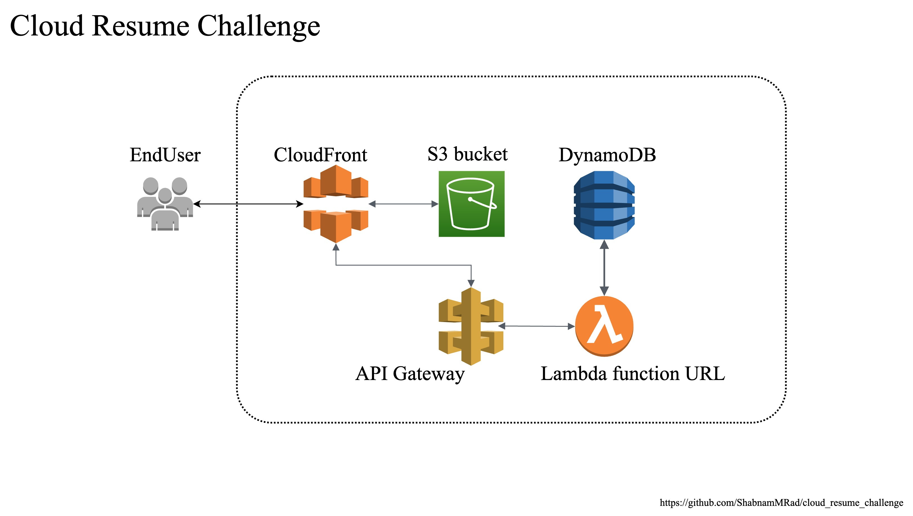

The cloud resume challenge first created by Forrest Brazeal is an exciting, fun project for anyone
starting with the clouds to practice their skills.

There are 16 steps to take, starting from building a website and hosting it via cloud services. I chose aws services.

The tech stack: 

- website: HTML, CSS, JS
- S3 bucket to store the website files in
- DynamoDB
- Lambda function URL
- API Gateway
- CloudFront
- Github to store the source codes
- Github actions for CI/CD
- Terraform for the IaC

the services are shown also in architectural diagram here: 

Important note is that i configured all the services via aws management console. Then i took the step
to manage them via Terraform. If you also take this approach, you need to import all the 
services via Terraform. 
here is a very well documentation to help you with that: 
https://registry.terraform.io/providers/hashicorp/aws/latest/docs

link to the cloud resume challenge: https://cloudresumechallenge.dev/docs/the-challenge/aws/